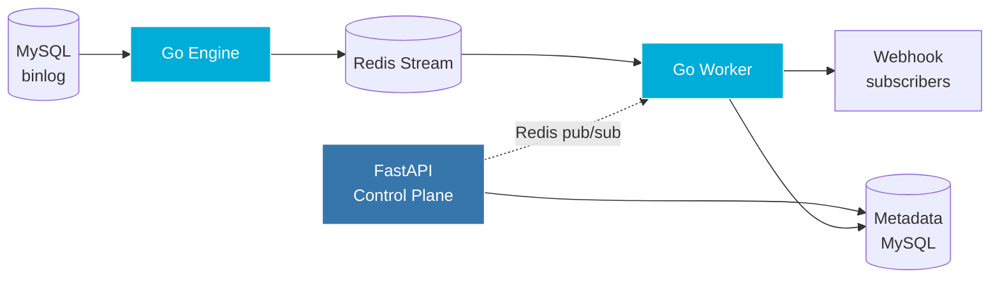

# Argus

[](https://github.com/anirudh204159/argus/actions/workflows/ci.yml)
[](https://go.dev)
[](https://www.python.org)
[](https://opensource.org/licenses/MIT)
[](https://github.com/anirudh204159/argus/releases)

> A self-hosted MySQL Change Data Capture platform. Reads the binary log, streams row changes to webhook subscribers in real time.

Built to eliminate dual-write inconsistency in cache invalidation, microservice sync, and search index updates.

---

## What it does

Your application writes a row. Argus reads it from MySQL's binary log within milliseconds and POSTs a signed JSON event to every subscribed webhook.

No application changes. No triggers. No polling.

**Source MySQL:**

```sql
INSERT INTO orders VALUES (1, 99.99, 'shipped');
```

**Webhook receives:**

```http
POST https://your-app.com/webhooks/argus
Content-Type: application/json
X-Argus-Signature: sha256=a39a7a2b64c2edda2e223ebb...
X-Argus-Subscription-Id: 2
X-Argus-Attempt: 1
User-Agent: Argus/0.1
```

```json
{
  "subscription_id": 2,
  "operation": "INSERT",
  "schema": "shop",
  "table": "orders",
  "before": null,
  "after": {"id": 1, "amount": "99.99", "status": "shipped"},
  "timestamp": "2026-05-16T22:14:03Z"
}
```

---

## Why CDC

Most systems try to keep two stores in sync by writing to both ("dual-write"). This fails when one write succeeds and the other doesn't, leaving stale caches, missed search index updates, and inconsistent microservices.

CDC solves this by treating MySQL as the source of truth. You write once. Everything downstream learns about it from the database's own replication log.

Argus is a small, self-hosted version of what Debezium does at enterprise scale.

---

## Architecture



- **Engine** (Go) reads MySQL's binary log via the replication protocol, parses INSERT/UPDATE/DELETE events, and publishes to a durable Redis Stream.
- **Worker** (Go) consumes via Redis consumer groups, matches events against active subscriptions, and delivers HMAC-signed HTTP POSTs.
- **Control Plane** (FastAPI) manages users, source databases, and subscriptions. Pushes config changes to the worker via Redis pub/sub.
- **Metadata DB** stores subscriptions, delivery logs, dead-letter events, and binlog checkpoints.

---

## Features

| Capability | v0.1 |
|---|:-:|
| MySQL binlog tailing (row-based format) | ✅ |
| INSERT, UPDATE, DELETE event capture | ✅ |
| Durable buffering via Redis Streams | ✅ |
| At-least-once webhook delivery | ✅ |
| HMAC-SHA256 payload signing | ✅ |
| Exponential backoff retries | ✅ |
| Dead-letter queue for permanent failures | ✅ |
| Full delivery audit log | ✅ |
| JWT-authenticated REST control plane | ✅ |
| Multi-tenant subscription isolation | ✅ |
| Binlog checkpointing + resume on restart | ✅ |
| Graceful shutdown (SIGINT/SIGTERM) | ✅ |
| Live config updates via Redis pub/sub | ✅ |
| Prometheus metrics + health endpoints | ✅ |
| 24-test Pytest suite for control plane | ✅ |

---

## Performance

Single-node, local Docker setup. 100 inserts at 50 events/sec. Source MySQL → engine → Redis → worker → local HTTP receiver.

| Metric | Value |
|---|---|
| Delivery success rate | **100%** (0 lost) |
| End-to-end p50 latency | **8 ms** |
| End-to-end p95 latency | **21 ms** |
| End-to-end p99 latency | **82 ms** |

Latency dominated by Redis roundtrip and HMAC computation. Real-world latency to remote webhooks is dominated by network RTT to the consumer.

*Benchmark source: [`engine/benchmarks/throughput.go`](engine/benchmarks/throughput.go)*

---

## Quick start

<details>
<summary><b>Click to expand</b></summary>

Prerequisites: Docker, Go 1.22+, Python 3.12+.

**1. Start infrastructure** (source MySQL, metadata MySQL, Redis):

```bash
git clone https://github.com/anirudh204159/argus.git
cd argus
docker compose up -d
```

**2. Start the control plane:**

```bash
cd control-plane
python -m venv .venv
source .venv/bin/activate           # Windows: .venv\Scripts\activate
pip install -r requirements.txt
alembic upgrade head
uvicorn app.main:app --reload --port 8000
```

**3. Start the engine** (separate terminal):

```bash
cd engine
go run ./cmd/engine
```

**4. Start the worker** (separate terminal):

```bash
cd engine
go run ./cmd/worker
```

**5. Configure via Swagger** at `http://localhost:8000/docs`:

- Register a user
- Create a source pointing at `argus-source-mysql:3306`
- Create a subscription with a webhook URL (use [webhook.site](https://webhook.site) for testing)

**6. Trigger an event:**

```bash
docker exec -it argus-source-mysql mysql -uroot -prootpass argus_demo
```

```sql
INSERT INTO orders VALUES (1, 99.99, 'shipped');
```

Your webhook URL receives a signed event within milliseconds.

</details>

---

## Observability

Both binaries expose Prometheus metrics on dedicated ports:

| Endpoint | Purpose |
|---|---|
| `http://localhost:9101/metrics` | Engine metrics |
| `http://localhost:9102/metrics` | Worker metrics |
| `http://localhost:91XX/healthz` | Liveness probe |
| `http://localhost:91XX/readyz` | Readiness probe |

**Key metrics:**

- `argus_binlog_events_total{operation}` — events read from binlog
- `argus_deliveries_total{status}` — webhook delivery outcomes
- `argus_delivery_duration_milliseconds` — latency histogram (p50/p95/p99)
- `argus_dlq_writes_total` — failed events sent to dead-letter queue
- `argus_subscriptions_active` — current active subscription count

---

## Delivery guarantees

- **At-least-once delivery.** Subscribers must be idempotent. Argus does not guarantee exactly-once.
- **Per-table ordering preserved.** Cross-table ordering is not guaranteed (same trade-off Kafka makes).
- **Signed payloads.** Every webhook includes `X-Argus-Signature: sha256=...` for HMAC verification.
- **Durable across crashes.** Engine checkpoints binlog position every 5s and on graceful shutdown. Events that occur during downtime are processed on restart.

---

## Tech stack

**Engine + Worker:** Go 1.22, [go-mysql](https://github.com/go-mysql-org/go-mysql), [go-redis](https://github.com/redis/go-redis), [prometheus/client_golang](https://github.com/prometheus/client_golang)

**Control Plane:** Python 3.12, FastAPI, SQLAlchemy, Pydantic, Alembic, Pytest, JWT, bcrypt

**Infrastructure:** MySQL 8.0, Redis 7, Docker Compose

---

## Roadmap

Planned for future versions:

- Web dashboard (React + Vite + Tailwind) — login, source/subscription management, live event stream
- Filter DSL for subscriptions (currently table + operation only)
- Multiple source databases per Argus instance
- GTID-based replication (currently file+position)
- Encrypted source credentials at rest (AES-GCM)
- Multi-worker horizontal scaling
- PostgreSQL source support
- CI/CD pipeline (GitHub Actions)

---

## License

[MIT](LICENSE)