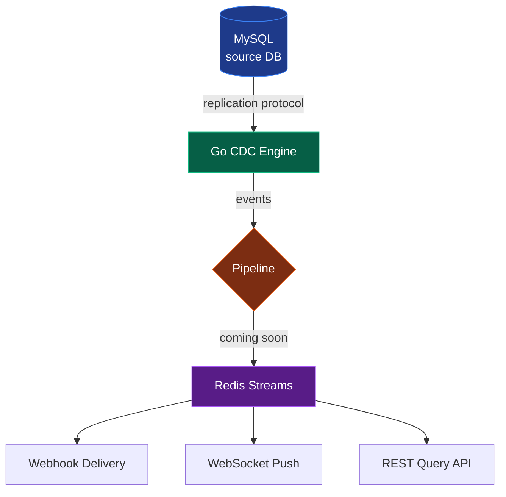

# Argus

> Real-time change data capture for MySQL. See every row change, deliver anywhere.

Argus is a self-hosted CDC platform that taps MySQL's binary log, normalizes row changes into structured events, and delivers them to downstream consumers via webhooks (and more in future versions). Zero application changes required.

## Status

Early development — engine MVP working, control plane and delivery layer in progress.

## Architecture



The engine connects to MySQL using the replication protocol (acting as a virtual replica), parses binary log events, and forwards normalized row changes to a delivery pipeline. Future work adds Redis Streams as a durable buffer and three consumer types: webhooks, WebSocket subscribers, and a REST query API.

## Components

- `engine/` — Go binlog reader and event pipeline
- `control-plane/` — Python/FastAPI subscription management API (planned)
- `docker/` — container definitions
- `docker-compose.yml` — local development stack (planned)

## Development

### Prerequisites

- Go 1.26+
- Docker Desktop
- Python 3.11+ (for control plane, when added)

### Run the engine

The engine connects to a MySQL instance via the replication protocol and prints every row change in real time.

```bash
cd engine
go run .
```

It expects MySQL with binlog enabled at `127.0.0.1:3307` (configured in `main.go`).

## License

TBD